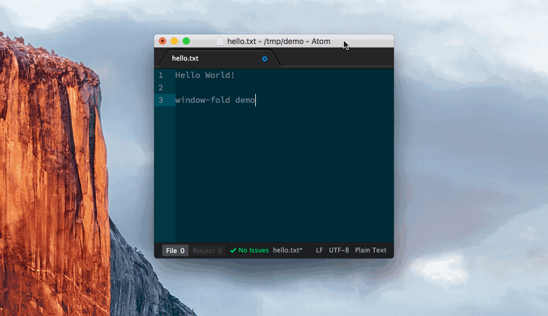

# WindowFold Package for Atom

Don't like resizing the text editor manually when opening or closing panels?

`ctrl-alt-k` marks the current size of the text pane. When you open another panel, pressing `ctrl-alt-k` again will restore the text editor to its previous size and position. Pressing `ctrl-alt-k` when the size didn't change deactivates this behavior.

This package is in an early stage of development (and learning CoffeeScript); expect the unexpected!

## To do

- [ ] automatically adjust the window size when panels are added or removed (no need to trigger resize manually)
- [ ] visual cue if text editor size is locked, or otherwise improve usability
- [ ] additional text panes will adjust their width when the window is resized, which must be respected when calculating the amount to resize

## Links

* http://atom.io

